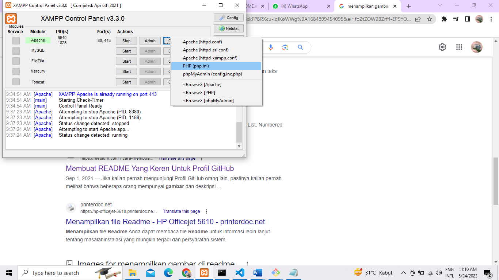
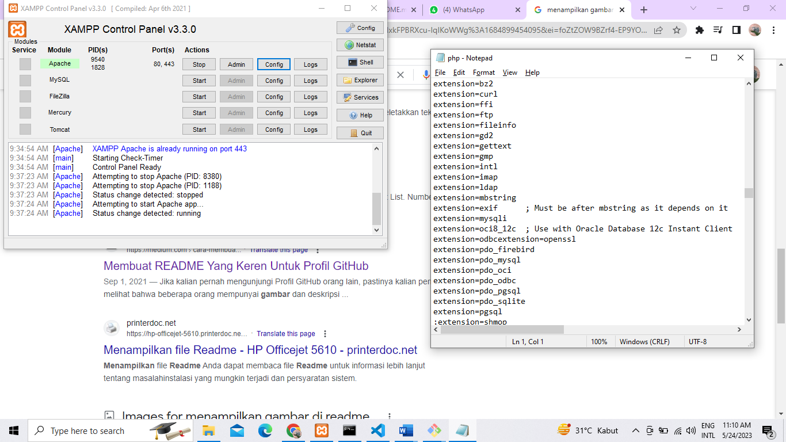
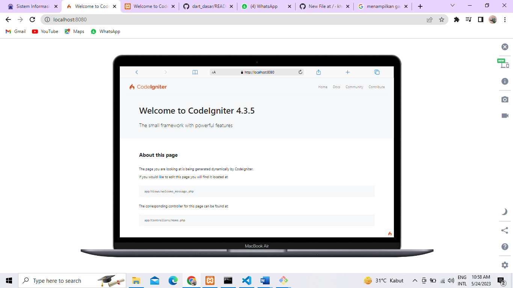
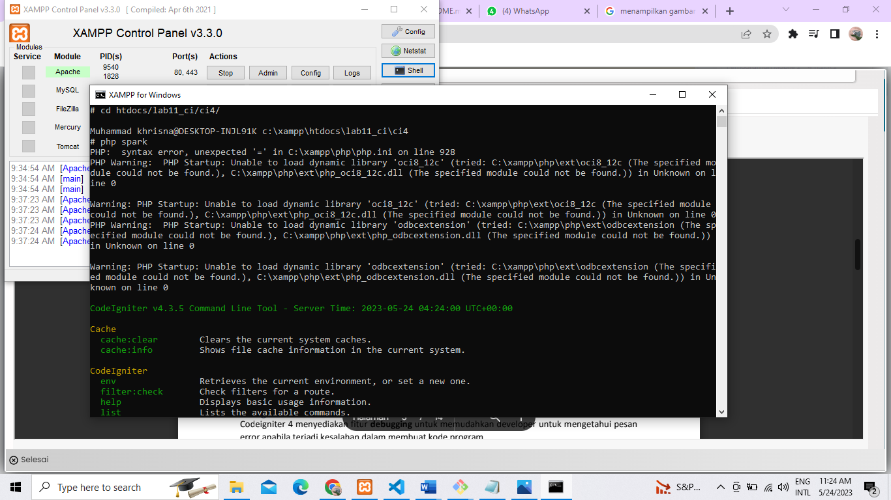
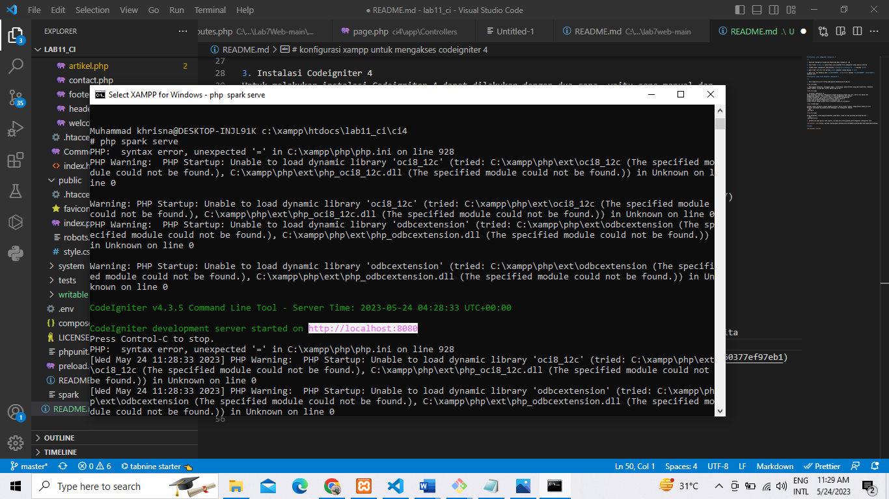
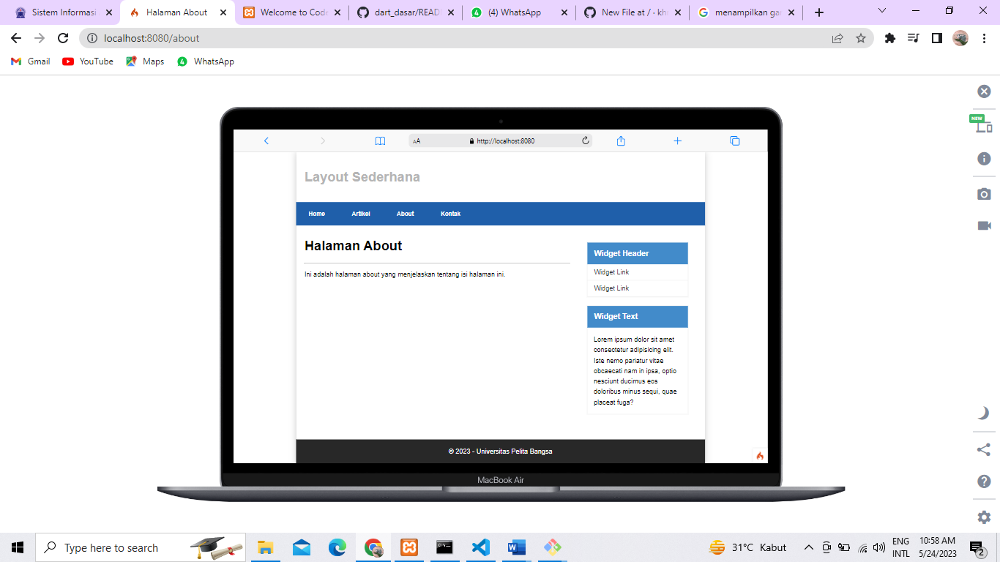

# lab11_ci
# penggunaan codeigniter 4

---

1. download codeigniter4 yang bisa pada website codeigniter.com

2. buat folder **lab11_ci** pada htdocs lalu masukkan file codeigniter yang sudah di ekstrak

3. rename folder codeigniter yang awalnya **codeigniter4-framework-v4....** menjadi **ci4**

4. pada folder ci4 cari file bernama **env** kemudian rename menjadi **.env**

5. buka file .env kemudian ubah **CI_ENVIRONMENT = production** menjadi **CI_ENVIRONMENT = development** kemudian save

# konfigurasi xampp untuk mengakses codeigniter 4

---

1. buka xampp lalu pilih config pada apache kemudian pilih php.ini



2. Pada bagian extention, hilangkan tanda ; (titik koma) pada ekstensi yang akan diaktifkan. Kemudian
simpan kembali filenya dan restart Apache web server !



3. Instalasi Codeigniter 4
Untuk melakukan instalasi Codeigniter 4 dapat dilakukan dengan dua cara, yaitu cara manual dan
menggunakan composer. Pada praktikum ini kita menggunakan cara manual.
• Unduh Codeigniter dari website https://codeigniter.com/download
• Extrak file zip Codeigniter ke direktori htdocs/lab11_ci.
• Ubah nama direktory framework-4.x.xx menjadi ci4.
• Buka browser dengan alamat http://localhost/lab11_ci/ci4/public/



Arahkan lokasi direktori sesuai dengan direktori kerja project dibuat (xampp/htdocs/lab11_ci/ci4/)
Perintah yang dapat dijalankan untuk memanggil CLI Codeigniter adalah:
```php
 php spark
```


Untuk mengetahui route yang ditambahkan sudah benar, buka CLI dan jalankan perintah berikut :
```php
 php spark serve
```
4. setelah itu akan muncul code seperti ini yang bisa kita gunakan untuk mengakses codeigniter kita



## output

- Laman home

- Laman about

- Laman artikel

- Laman kontak

